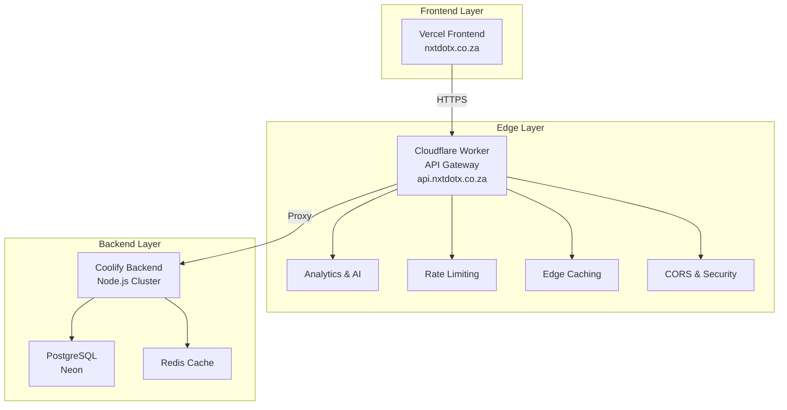

# NXT New Day - Complete Architecture

## 🏗️ System Overview

This document outlines the complete deployment architecture for NXT New Day, incorporating Cloudflare Workers as an intelligent API gateway.

## 📊 Architecture Diagram



## 🎯 Component Breakdown

### 1. Frontend (Vercel)
- **Technology**: Next.js/React
- **Deployment**: Vercel
- **Domain**: `nxtdotx.co.za`
- **Purpose**: User interface and client-side logic

### 2. Cloudflare Worker (API Gateway)
- **Technology**: Cloudflare Workers
- **Domain**: `api.nxtdotx.co.za`
- **Features**:
  - ✅ **Request Proxying** - Routes to Coolify backend
  - ✅ **Analytics** - Real-time request logging
  - ✅ **AI Features** - Anomaly detection, predictive routing
  - ✅ **Rate Limiting** - 100 requests per 15 minutes per IP
  - ✅ **Edge Caching** - 5-minute cache for GET requests
  - ✅ **CORS Handling** - Automatic CORS headers
  - ✅ **Security** - Bot detection, geographic filtering

### 3. Backend (Coolify)
- **Technology**: Node.js with clustering
- **Deployment**: Coolify (Docker)
- **Database**: Neon PostgreSQL
- **Cache**: Redis
- **Port**: 4000

## 🚀 Deployment Strategy

### Phase 1: Backend Deployment
1. **Deploy to Coolify** using provided Docker configuration
2. **Configure environment variables** (DATABASE_URL, REDIS_URL, etc.)
3. **Test backend** directly via Coolify URL

### Phase 2: Cloudflare Worker Setup
1. **Create KV namespaces** in Cloudflare dashboard
2. **Deploy Worker** using provided scripts
3. **Configure custom domain** `api.nxtdotx.co.za`
4. **Test gateway** functionality

### Phase 3: Frontend Integration
1. **Update frontend** to use Worker URL
2. **Configure CORS** if needed
3. **Test end-to-end** flow

## 🔧 Configuration Files

### Backend (Coolify)
- `Dockerfile` - Production container
- `docker-compose.yml` - Local development
- `coolify.json` - Coolify configuration
- `deploy.sh` - Deployment automation

### Cloudflare Worker
- `src/index.js` - Main worker logic
- `wrangler.toml` - Worker configuration
- `package.json` - Dependencies
- `deploy-gateway.sh` - Deployment script

## 📊 Analytics & AI Features

### Real-time Analytics
- Request/response logging
- Performance metrics
- Geographic data
- Error tracking

### AI Capabilities
- **Anomaly Detection**: Identifies unusual response patterns
- **Predictive Routing**: Smart traffic routing based on geography
- **Rate Limiting**: Intelligent abuse prevention
- **Caching Optimization**: Dynamic cache TTL based on usage

## 🛡️ Security Features

### Edge Security
- Rate limiting per IP
- Geographic restrictions
- Bot detection
- SSL/TLS termination

### Backend Security
- Environment variable protection
- Database connection security
- Redis security

## 🎯 Benefits of This Architecture

| Feature | Traditional | With Cloudflare Worker |
|---------|-------------|------------------------|
| **Performance** | Single region | Global edge caching |
| **Analytics** | Backend only | Real-time edge analytics |
| **Security** | Backend only | Edge + backend security |
| **Scalability** | Manual scaling | Automatic edge scaling |
| **Monitoring** | Backend logs | Real-time edge monitoring |
| **Caching** | Backend only | Edge + backend caching |

## 🚀 Quick Start Commands

### Deploy Backend
```bash
cd ../NXT-NEWDAY-BACKEND
./deploy.sh
```

### Deploy Cloudflare Worker
```bash
cd cloudflare-worker
./deploy-gateway.sh
```

### Test Architecture
```bash
# Test backend directly
curl https://your-coolify-domain.com/health

# Test through gateway
curl https://api.nxtdotx.co.za/health

# Test frontend
curl https://nxtdotx.co.za
```

## 🔍 Monitoring & Debugging

### Backend Monitoring
- Coolify dashboard logs
- Health check endpoint: `/health`
- Database connection status

### Worker Monitoring
- Cloudflare dashboard analytics
- Real-time logs: `wrangler tail`
- KV storage queries

### Frontend Monitoring
- Vercel analytics
- Browser developer tools
- Network tab inspection

## 📈 Scaling Considerations

### Horizontal Scaling
- **Backend**: Coolify auto-scaling
- **Worker**: Cloudflare edge scaling
- **Database**: Neon scaling
- **Cache**: Redis scaling

### Performance Optimization
- **Edge caching** reduces backend load
- **Rate limiting** prevents abuse
- **Geographic routing** improves latency
- **Connection pooling** optimizes database usage

## 🔄 CI/CD Pipeline

### Backend Pipeline
1. Git push triggers build
2. Docker image build
3. Coolify deployment
4. Health check verification

### Worker Pipeline
1. Code changes trigger build
2. Wrangler deployment
3. KV namespace updates
4. Domain configuration

## 🎛️ Environment Management

### Production
- Backend: Coolify production
- Worker: Production environment
- Database: Neon production
- Domain: `api.nxtdotx.co.za`

### Staging
- Backend: Coolify staging
- Worker: Staging environment
- Database: Neon staging
- Domain: `staging-api.nxtdotx.co.za`

### Development
- Backend: Local Docker
- Worker: Local development
- Database: Local PostgreSQL
- Domain: `localhost:4000`

## 📋 Next Steps

1. **Deploy backend** to Coolify
2. **Set up KV namespaces** in Cloudflare
3. **Deploy worker** to Cloudflare
4. **Configure custom domain**
5. **Update frontend** to use worker URL
6. **Test end-to-end** flow
7. **Monitor analytics** and performance
8. **Scale based** on usage patterns